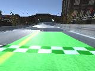
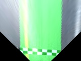
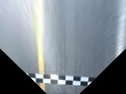

# cv_racer

cv_racer works with donkeycar simulator.<br>
donkeycar: [https://github.com/autorope/donkeycar](https://github.com/autorope/donkeycar)<br>
Donkey Simulator: [https://docs.donkeycar.com/guide/simulator/](https://docs.donkeycar.com/guide/simulator/)<br>


## Youtube
[](https://www.youtube.com/watch?v=gJVX4n1TsVI)

<hr>

## Usage
```
python cv_racer.py --host=localhost --name=naisy_cv
```

<hr>

## Edit
* car info
```
vi cv_racer.py
```
```
    conf = { "body_style" : "donkey", 
        "body_rgb" : (255, 0, 0),
        "car_name" : name,
        "racer_name" : "naisy_cv",
        "country" : "Japan",
        "bio" : "I am OpenCV.",
        "font_size" : "75"
        }
```
* max throttle
```
vi cv_racer.py
```
```
        self.max_throttle = 0.3
```
* check the coordinates for inverse perspective mapping
```
python to_inverse_perspective_mapping.py
```
before ipm:<br>
<br>
after ipm:<br>
<br>
<br>

With to_region_of_interest.py and to_white.py you can check the ROI and color filters.

<hr>

## Reference
* [CarND-Advanced-Lane-Lines](https://github.com/udacity/CarND-Advanced-Lane-Lines)
* [Level 5: ロボットカー走行デモ Realtime Object Detection版](https://faboplatform.github.io/RobotCarAI/12.level5_demo_streaming/)
* [車のハンドルの手書き風イラストアイコン](https://rakugakiicon.com/?p=1924)